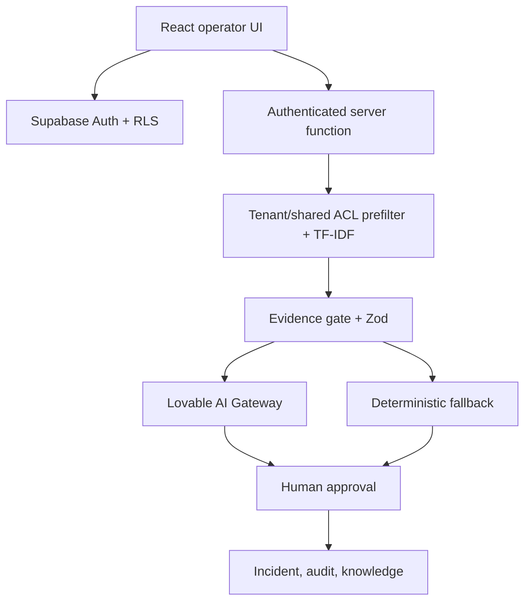

# Architecture

The browser owns presentation and user-initiated CRUD. Supabase RLS is the authorization source of truth. `runTriage` attaches a user-scoped Supabase client, verifies demo failure injection authorization, retrieves tenant-private plus redacted approved shared chunks, ranks deterministically, records retrieval evidence, calls the model, validates the JSON, caps confidence and persists suggestions. No server path applies operational actions.

The webhook is isolated under `/api/webhooks/incidents`: secret + idempotency + size + schema checks precede service-role persistence. MCP exposes bounded incident/knowledge tools and inherits Supabase authorization.

Data model: organization/membership/system; incident/event/comment; AI run/triage/hypothesis/action/execution; postmortem; article/chunk/link/retrieval; problem; evaluation; ingestion; webhook; audit.
